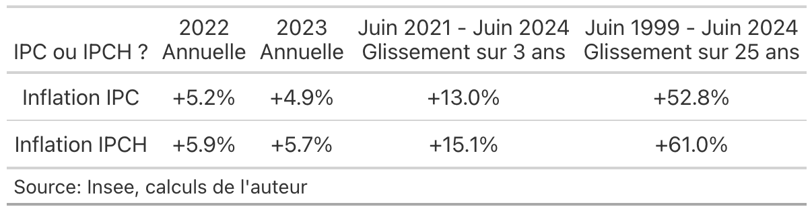
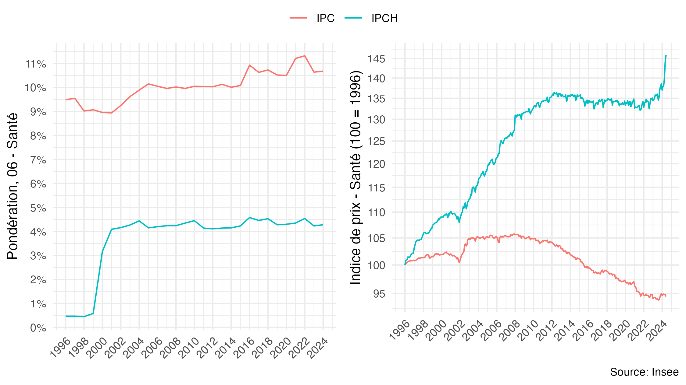
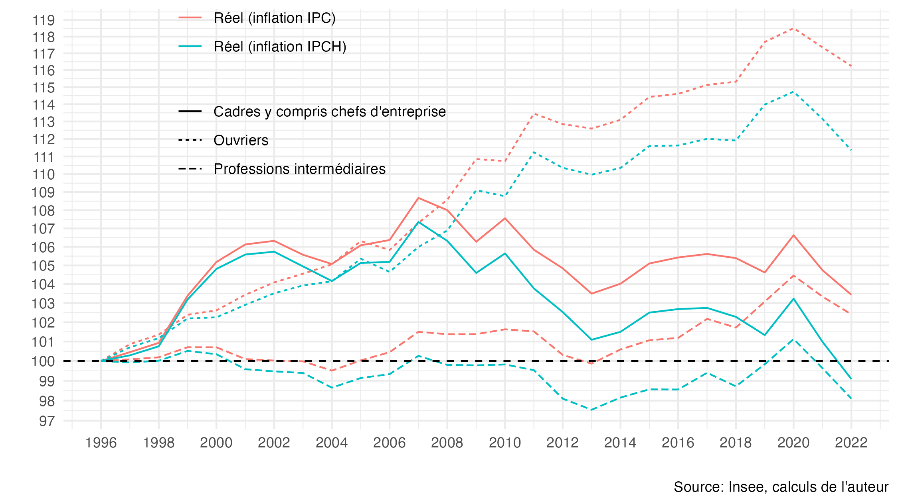
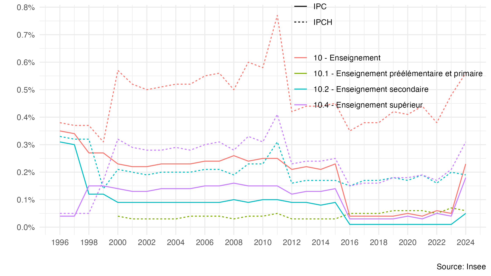
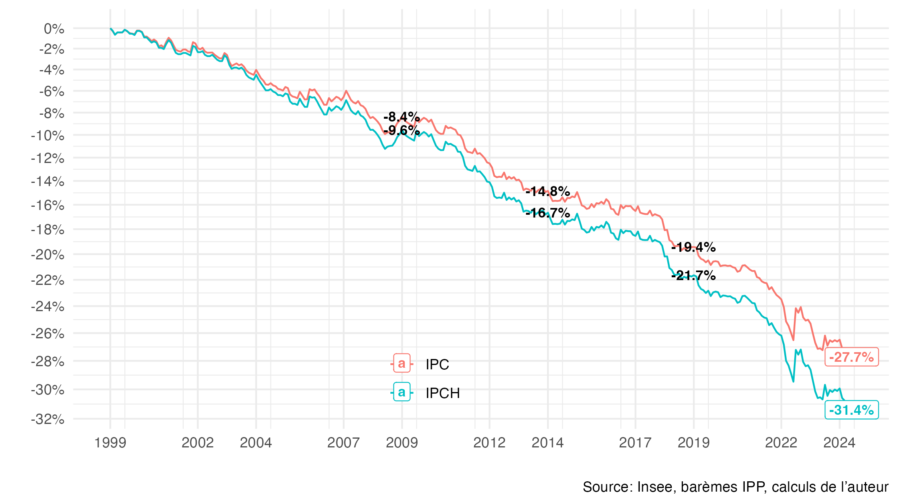

# Inflation en France : IPC ou IPCH ?

Date de publication: 9 juillet 2024.

Ce dépôt met à disposition des codes de réplication pour la [note en lien](https://fgeerolf.com/IPC-ou-IPCH.pdf), ainsi que des outils pour calculer des évolutions en euros constants à partir de l'IPCH, plutôt que de l'IPC.

  <!-- Reader Navigation -->
  **[📖 Lire en ligne](https://fgeerolf.com/IPC-ou-IPCH.html)** •
  **[📄 Version PDF](https://fgeerolf.com/IPC-ou-IPCH.pdf)** •
  **[🌐 Présentation HTML](https://fgeerolf.com/IPC-ou-IPCH-handouts.html)**•
  **[📓 Présentation PDF](https://fgeerolf.com/IPC-ou-IPCH-slides.pdf)** 

## Réplication

Le dépôt contient de quoi répliquer les figures et les données de la [note en lien](https://fgeerolf.com/IPC-ou-IPCH.pdf):

### Table 1 : Inflation selon l’IPC ou l’IPCH.

[Code R](R/table1.R)

### Figure 1 : Poids et évolution de l’indice santé dans l’IPC et dans l’IPCH.

[Code R](R/figure1.R)

### Figure 2 : Évolution des salaires annuels « en euros constants » par catégorie socio-professionnelle, en utilisant l’inflation IPC et en utilisant l’inflation IPCH.

[Code R](R/figure2.R)

### Figure A1 : Poids de l’enseignement dans l’IPC et dans l’IPCH.

[Code R](R/figureA1.R)

### Figure A2 : Pouvoir d’achat du point d’indice net de la fonction publique, IPC vs. IPCH.

[Code R](R/figureA2.R)

## Outils pour calculer des évolutions en euros constants

