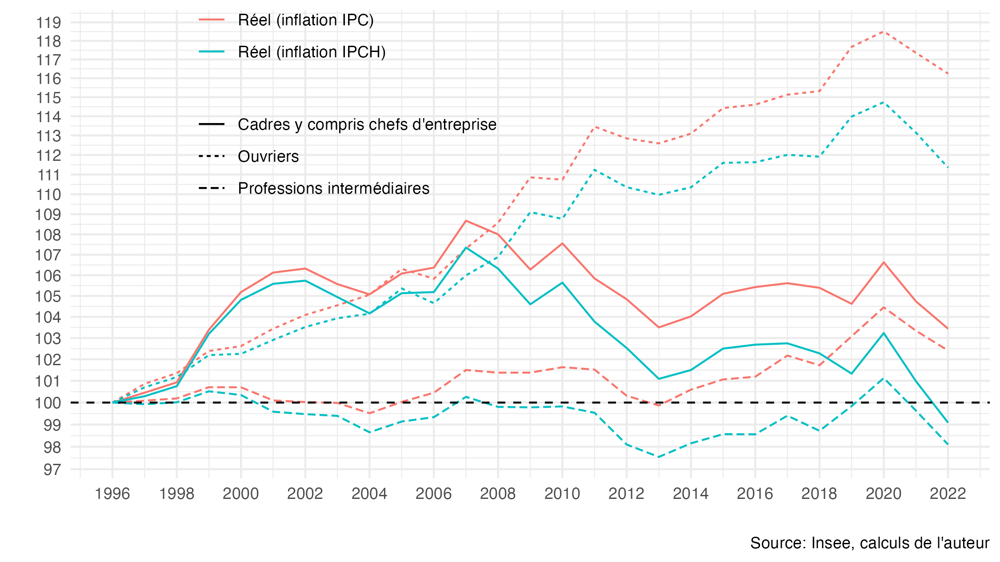

# Indice des prix à la consommation (IPC) ou IPC harmonisé (IPCH) ?

Ce dépôt met à disposition des outils de réplication pour la [note en lien](https://fgeerolf.com/IPC-ou-IPCH.pdf), ainsi que des outils pour calculer des évolutions en euros constants à partir de l'IPCH, plutôt que de l'IPC.

## Réplication

Le dépôt contient de quoi répliquer les figures et les données de la [note en lien](https://fgeerolf.com/IPC-ou-IPCH.pdf):

- Table 1 : Inflation selon l’IPC ou l’IPCH. [code R](table1.R)

- Figure 1 : Poids et évolution de l’indice santé dans l’IPC et dans l’IPCH
- Figure 2 : Évolution des salaires annuels « en euros constants » par catégorie socio-professionnelle, en utilisant l’inflation IPC et en utilisant l’inflation IPCH.  [code R](figure2.R)

- Figure A1 : Poids de l’enseignement dans l’IPC et dans l’IPCH
- Figure A2 : Pouvoir d’achat du point d’indice net de la fonction publique, IPC vs. IPCH

## Outils pour calculer des évolutions en euros constants

